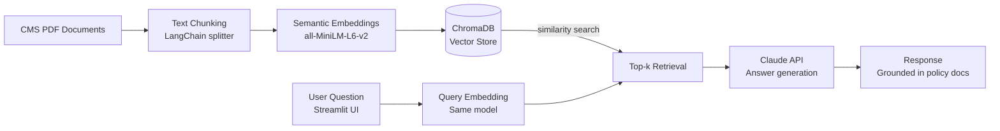
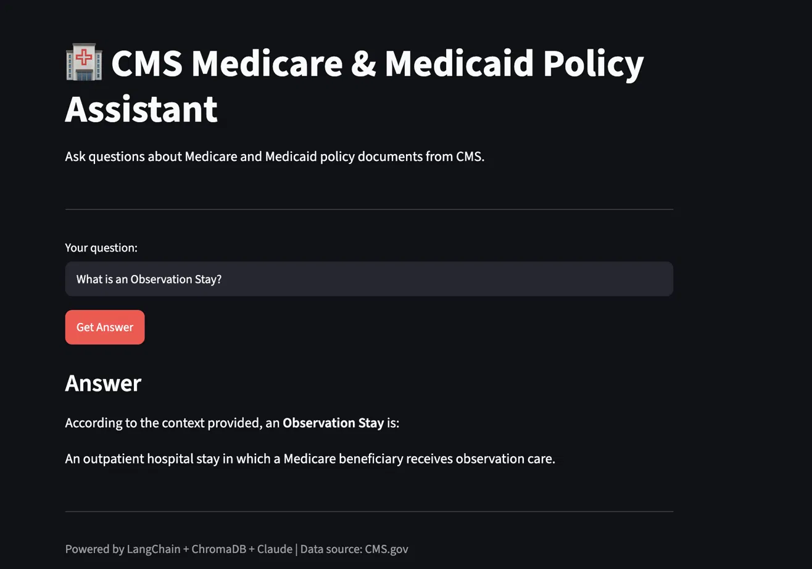

**CMS Medicare & Medicaid Policy Assistant**

A Retrieval-Augmented Generation (RAG) application that enables natural language querying of CMS Medicare and Medicaid policy documents using LangChain, ChromaDB, and Claude (Anthropic).

## Tech Stack

- LangChain: document loading and text splitting
- ChromaDB: local vector database for chunk storage and retrieval
- Sentence Transformers (all-MiniLM-L6-v2): semantic embedding generation
- Claude (Anthropic): answer generation from retrieved context
- Streamlit: interactive web interface
- Python 3.13

**Data Sources**

Public CMS documents from data.cms.gov including Medicare Monthly Enrollment, Medicare Advantage Enrollment Methodology, Medicaid Opioid Prescribing Rates, and CMS Program Statistics Glossary.

**How to Run**

1. Install dependencies: pip install langchain langchain-chroma langchain-huggingface sentence-transformers langchain-text-splitters pypdf chromadb anthropic python-dotenv streamlit
2. Add ANTHROPIC_API_KEY to a .env file
3. Build vector store: python3 src/embed.py
4. Launch app: streamlit run src/app.py

## Project Structure

- data/raw: source PDF documents
- data/chroma_db: persisted vector store
- src/ingest.py: PDF loading and chunking
- src/embed.py: semantic embedding generation and vector storage
- src/query.py: retrieval and Claude answer generation
- src/app.py: Streamlit interface

## Future Improvements

- Add source citation showing which document each answer came from
- Expand document corpus with full CMS policy library
- Add conversation memory for multi-turn Q&A

## Architecture

## Demo

